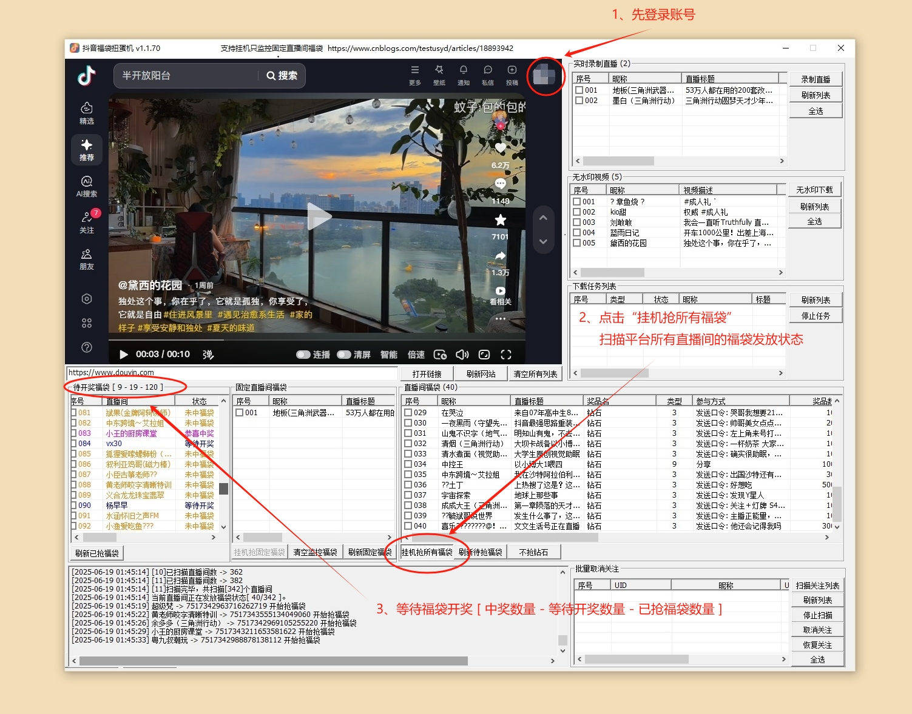
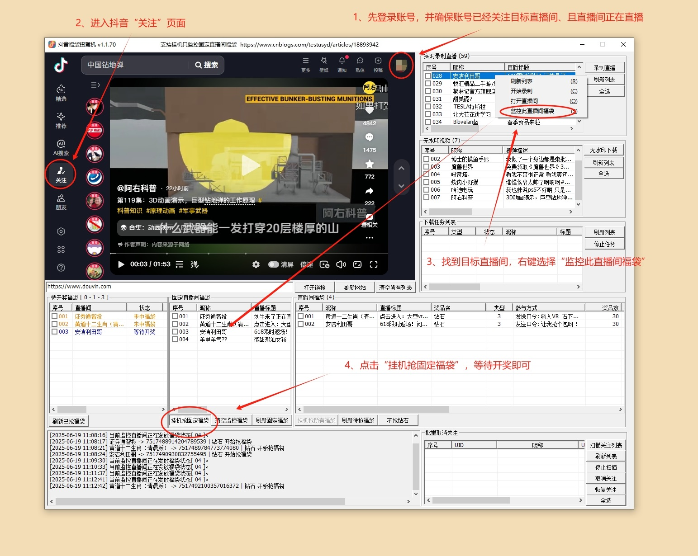
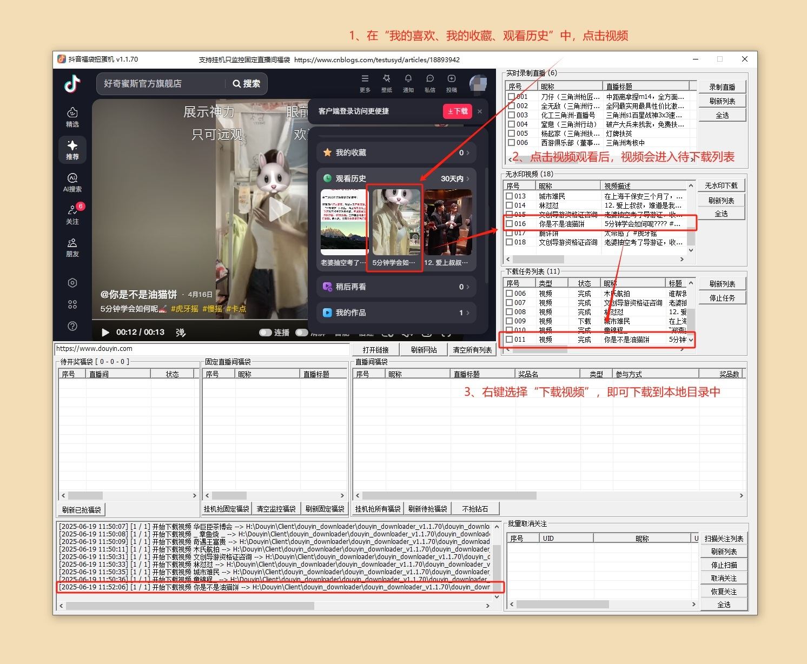
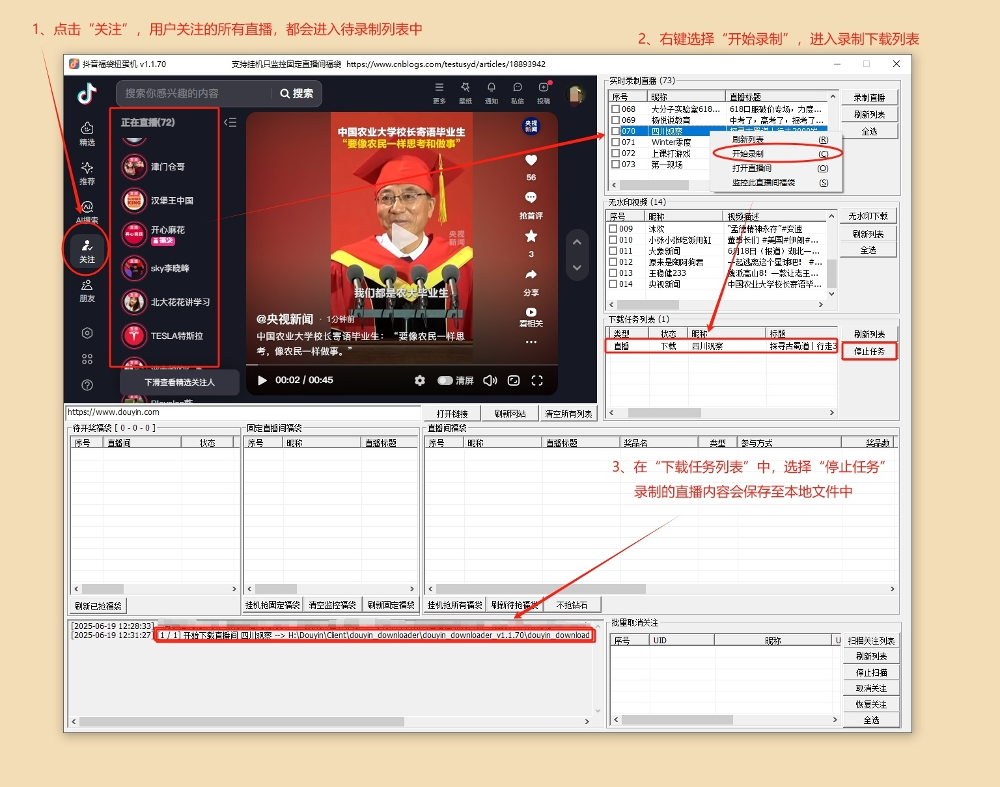
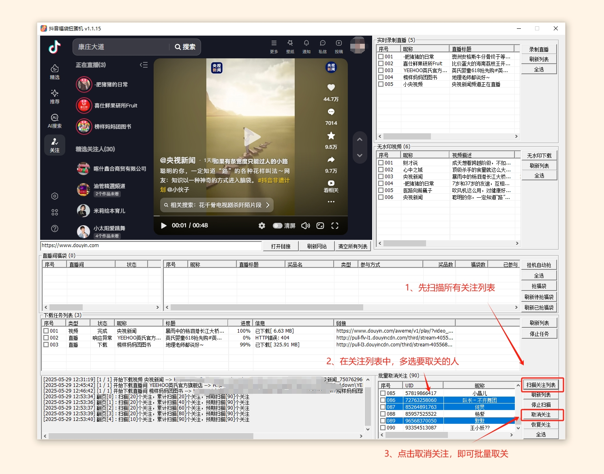

# douyin_downloader

抖音福袋扭蛋机 v2.2.0

[2025-07-28] 抖音福袋扭蛋机，抖音抢福袋工具，抖音无水印视频下载器，抖音直播间录制下载器，抖音批量取消关注取关器。

目前软件是Beta版本，更新比较频繁还请见谅。等软件测试成熟后才会考虑收费，在此之前请放心使用。

注意：如果遇到打不开软件或解压出现问题的情况，可能需要在使用本软件时临时关闭杀毒软件或Windows Defender。
关闭方式如下：
https://www.cnblogs.com/emanlee/p/17406620.html

如果还不能正常运行，可能是运行环境损坏或不全导致的，下载运行时环境，解压并覆盖到软件目录即可：
http://www.app-bos.com/iKhph321j8ba

v2.2.0

优化了抢福袋策略，可自定义福袋倒计时几分钟再抢。设置倒计时10分钟抢福袋，效果与1.1.80版本一致。推荐默认设置5分钟，减小被风控概率。
增加NTP时间同步，避免抢福袋时因时间戳错位问题导致失败。
增加了部分广告位，可以在博客园私信作者合作。
修复了几个用户反馈的bug。

v2.1.0

增加了保存登录状态，不需要每次登录都需要扫码。请注意登录状态失效的问题（状态维持时间不固定，随时有被抖音踢下线的风险）。
增加了日志和福袋列表自动清理，日志和福袋信息积累过多时会自动清理列表，防止软件卡顿，也可以手动清理。
优化了不抢钻石只抢实物福袋的算法，会积极在直播间中逗留增加中奖概率。
优化了抢福袋的策略，尽可能的避免被系统风控。当前策略下即使被风控，风控期也不会太长（一般就1天左右），风控期间不会中任何福袋。
增加了抢购福袋奖品的显示，现在在“待开奖福袋”的列表中，最后一排显示奖品名称。

使用说明：

1.打开douyin_downloader软件目录，运行douyin_downloader.exe即可。

2.直播间抢福袋功能，支持扫描平台所有直播间，并过滤出正在发放福袋的直播间进行参与。

3.抢福袋可指定固定直播间，蹲点抢福袋功能，可以预先设置指定的直播间进行蹲点抢福袋。

4.可以设置不抢钻石、只抢实物福袋。在实物福袋模式下，优化了算法，增加了中奖概率。

5.如果福袋中奖率过高，账号可能会被官方风控，一段时间内不会再中福袋（一般1-2天）。等一段时间再试试即可。

6.直播间抢福袋、HD高清录制、批量取关的功能，需要用户登录抖音账号。

7.直播间录制的MP4视频，有时候会出现进度条异常或黑屏的情况，可能是由于网络波动导致的视频文件不完整。使用MP4视频修复软件修复一下即可。

8.批量取关的博主数量如果过多，可能会被官方弹出验证码。请自行手动解决验证码问题。

更多图文教程：
https://www.cnblogs.com/testusyd/articles/18893942
https://github.com/testusyd/douyin_downloader

v2.1.0 Release版本下载

https://github.com/testusyd/douyin_downloader/releases/tag/%E6%8A%96%E9%9F%B3

https://github.com/testusyd/douyin_downloader/releases/download/%E6%8A%96%E9%9F%B3/douyin_downloader_v2.2.0.zip

**1、挂机扫描平台所有直播间抢福袋**

**2、挂机监控指定直播间抢福袋**

**3、下载无水印视频**

**4、录制直播间内容**

**5、批量取消关注**

