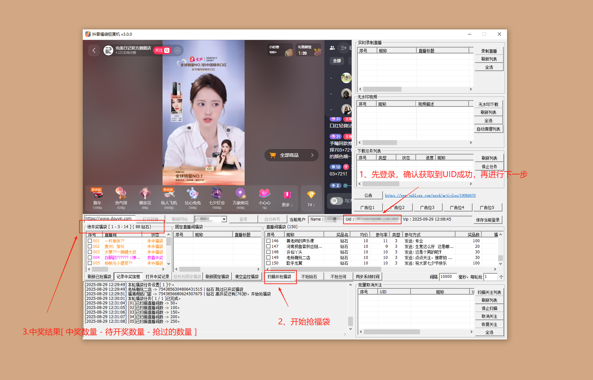

# douyin_downloader

抖音福袋扭蛋机 v3.0.0

[2025-08-29] 抖音福袋扭蛋机，抖音抢福袋工具，抖音无水印视频下载器，抖音直播间录制下载器，抖音批量取消关注取关器。

最新公告：

	https://github.com/testusyd/douyin_downloader

	https://www.cnblogs.com/usyd/articles/19056870

新版本的通知群：
qq群：

	1054615016

	1054623998

TG：https://t.me/+JpmgXE_1KIZhMzM0

v3.0.0

	当前版本恢复了抢福袋的功能。以下是情况说明（请必读）：
	
	官方封禁了2.2.0之前所有的接口，也对每个DY账号每日最多中福袋的数量增加了很多限制，导致每个账号单日能抢的福袋数量大幅减少了。
	
	而且官方还限制了单个IP请求发送的频率，从根源上禁止了单机多开抢福袋的情况。所以3.0.0版本非常不建议多开，多开可能会导致请求错误的同时，账号也可能会被官方标注，进入风控名单。
	
	以上是官方的限制问题，不是技术可以解决的，希望能够理解。大家也可以多测试，找到更好的边际方案。

	3.0.0版本是半免费版本。发布免费版本也是我的初心，但是也对免费版本做了技术上的限制，主要是为了防止像以前2.2.0版本那样被滥用，导致全面封禁的结果。所以大家可以按照自己的需求做决定。

		1.当前版本还是可以像以前一样使用，但是福袋池会有区别。免费用户检索的直播间福袋是没有优化过的福袋池，比如人很多的直播间，福袋参与的人数多，且福袋数量少，是总体命中率较低的福袋池。
	
		2.免费版本用户，每分钟（每轮）仅可以抢1个福袋。这样可以避免大量用户向DY直播间发送大量的请求，导致官方介入，保护大家总体的利益。
	
		3.我们预想VIP用户不会太多，所以VIP用户可以随意调整抢福袋的时间间隔和每轮福袋的数量，但仍然会限制每分钟最多抢10个福袋，主要还是考虑保护所有人的总体利益。
	
		4.VIP用户检索的福袋池是优化过的福袋池，比如有一些人数很少的直播间，会发一些比较大、数量比较多的福袋，命中率会很高，优先会让VIP用户参与。
	
		5.VIP用户9.9￥/月。运气好的话单日即回本。

v3.0.0 Release版本下载

https://github.com/testusyd/douyin_downloader/releases/tag/%E6%8A%96%E9%9F%B3

https://github.com/testusyd/douyin_downloader/releases/download/%E6%8A%96%E9%9F%B3/douyin_downloader_v3.0.0.zip

注意：如果遇到打不开软件或解压出现问题的情况，可能需要在使用本软件时临时关闭杀毒软件或Windows Defender。

关闭方式如下：

https://www.cnblogs.com/emanlee/p/17406620.html

如果还不能正常运行，可能是运行环境损坏或不全导致的，下载运行时环境，解压并覆盖到软件目录即可：

http://www.app-bos.com/iKhph321j8ba

------------------------------------------------------------------------------------------------------
历史版本更新说明：

v2.2.0

优化了抢福袋策略，可自定义福袋倒计时几分钟再抢。设置倒计时10分钟抢福袋，效果与1.1.80版本一致。推荐默认设置5分钟，减小被风控概率。

增加NTP时间同步，避免抢福袋时因时间戳错位问题导致失败。

增加了部分广告位，可以在博客园私信作者合作。

修复了几个用户反馈的bug。

v2.1.0

增加了保存登录状态，不需要每次登录都需要扫码。请注意登录状态失效的问题（状态维持时间不固定，随时有被抖音踢下线的风险）。

增加了日志和福袋列表自动清理，日志和福袋信息积累过多时会自动清理列表，防止软件卡顿，也可以手动清理。

优化了不抢钻石只抢实物福袋的算法，会积极在直播间中逗留增加中奖概率。

优化了抢福袋的策略，尽可能的避免被系统风控。当前策略下即使被风控，风控期也不会太长（一般就1天左右），风控期间不会中任何福袋。

增加了抢购福袋奖品的显示，现在在“待开奖福袋”的列表中，最后一排显示奖品名称。

使用说明：

1.打开douyin_downloader软件目录，运行douyin_downloader.exe即可。

2.直播间抢福袋功能，支持扫描平台所有直播间，并过滤出正在发放福袋的直播间进行参与。

3.抢福袋可指定固定直播间，蹲点抢福袋功能，可以预先设置指定的直播间进行蹲点抢福袋。

4.可以设置不抢钻石、只抢实物福袋。在实物福袋模式下，优化了算法，增加了中奖概率。

5.如果福袋中奖率过高，账号可能会被官方风控，一段时间内不会再中福袋（一般1-2天）。等一段时间再试试即可。

6.直播间抢福袋、HD高清录制、批量取关的功能，需要用户登录抖音账号。

7.直播间录制的MP4视频，有时候会出现进度条异常或黑屏的情况，可能是由于网络波动导致的视频文件不完整。使用MP4视频修复软件修复一下即可。

8.批量取关的博主数量如果过多，可能会被官方弹出验证码。请自行手动解决验证码问题。

**1、挂机扫描平台所有直播间抢福袋**

**2、挂机监控指定直播间抢福袋**

**3、下载无水印视频**

**4、录制直播间内容**

**5、批量取消关注**

